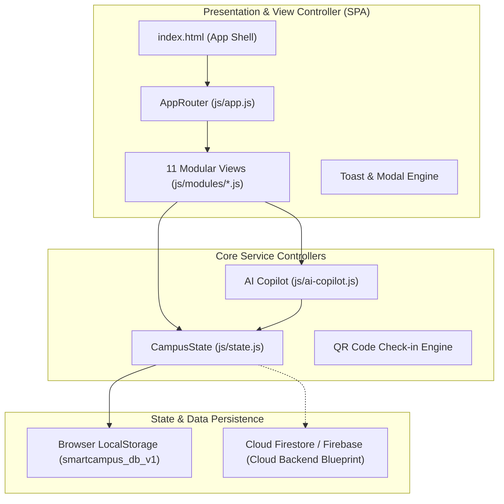

# 📘 SmartCampus - Comprehensive Project Handover Documentation

---

## 1. Document Control & Metadata

| Attribute | Details |
| :--- | :--- |
| **Project Name** | **SmartCampus** - Integrated Smart Campus Management Platform |
| **Repository Path** | `c:\Users\KASINADHSAJIKUMAR\Desktop\XPANCION SMART CAMPUS` |
| **Specification Ref** | `SmartCampus_README.md` (43 Modules & Scenarios) |
| **Document Version** | `1.0.0 (Production-Ready Handover)` |
| **Release State** | Functional Prototype & Modular SPA Architecture |
| **Handover Date** | September 25, 2026 |
| **Target Audience** | Incoming Engineering Leads, Full-Stack Developers, Cloud Architects, UI/UX Designers, Campus System Administrators |
| **Primary Tech Stack** | Vanilla HTML5 / ES6+ JavaScript Modules / CSS3 Design System / PowerShell Dev Server / Google Cloud & Firebase Blueprint |

---

## 2. Executive Summary & Vision Statement

### 2.1 The Problem It Solves
Traditional university and college campuses suffer from severe departmental fragmentation. Everyday student and faculty needs require navigating separate physical offices, disconnected notice boards, paper logbooks, and disparate software tools:
- **Lost & Found:** Relying on security physical ledgers or fragmented WhatsApp groups.
- **Maintenance & Facilities:** Unreported broken equipment (projectors, fans, ACs) or untracked verbal complaints with zero accountability.
- **Resource Utilization:** Students walking across campus to check if computer labs, seminar halls, or study rooms are free.
- **Navigation:** Confusion for first-year students and visitors locating specialized laboratories, faculty cabins, or administrative counters.
- **Emergency Dispatch:** Lack of a centralized, instantaneous distress panic button for medical, fire, or security incidents.
- **Information Silos:** Outdated notice boards, delayed circulars, and disconnected cafeteria or event registrations.

### 2.2 The SmartCampus Solution
**SmartCampus** is a **digital operating system for university life**. It unifies every constituent—students, faculty, administrators, security guards, and maintenance crews—into a single, high-performance, responsive platform.

```
                         CAMPUS CONSTITUENTS
           [ Students ]   [ Faculty ]   [ Staff & Admins ]
                 │             │               │
                 ▼             ▼               ▼
     ═══════════════════════════════════════════════════════
                   SMARTCAMPUS CORE PLATFORM
     ═══════════════════════════════════════════════════════
        │              │               │              │
        ▼              ▼               ▼              ▼
   [ AI Copilot ] [ Facilities ] [ Maintenance ] [ Safety/SOS ]
   [ Gemini NLP ] [ Rooms/Labs ] [  Ticketing  ] [ Realtime ]
        │              │               │              │
     ═══════════════════════════════════════════════════════
         CENTRAL REACTIVE DATA BUS & FIRESTORE STORAGE
     ═══════════════════════════════════════════════════════
```

### 2.3 Core Product Vision & Tagline
> **"One Campus. One Platform. Smarter Campus Life."**  
The platform eliminates operational friction by connecting every micro-service to shared authentication, real-time notification infrastructure, geo-spatial campus maps, and an intelligent AI assistant layer.

---

## 3. System Architecture & Core Engineering Principles

### 3.1 Uncompromising Architectural Principles
As mandated by the engineering specifications:
1. **No Disconnected Silos:** Every module communicates through the central state manager (`state.js`). A complaint links to a user, a specific campus room, a department, a maintenance worker, and triggers system notifications. A lost-and-found entry communicates with the AI matcher, location coordinates, and notification engine.
2. **Single Source of Truth (SSOT):** Application state is managed via a centralized reactive store (`window.campusState`) with event emission, localStorage hydration, and seamless migration path to Cloud Firestore.
3. **Zero Heavy Dependencies (Maximum Performance):** Built cleanly with native HTML5, modern modular CSS with design variables, and pure ES6+ JavaScript modules. No bloated node runtime required for client execution.
4. **Mobile-First Responsive UX:** Designed for handheld mobile devices, tablets, and full-screen desktop administrative command centers with fluid glassmorphic cards, intuitive bottom navigation on mobile, and collapsible side navigation on desktop.
5. **AI as an Assistant, Not an Autonomous Risk:** The AI Copilot and classifier provide recommendations, automated triage, and intelligent matching, but never make irreversible system changes without human verification.

### 3.2 High-Level Architecture Diagram



---

## 4. Role-Based Access Control (RBAC) Matrix

SmartCampus implements a comprehensive 5-role permission structure:

| Functional Area / Feature | 🎓 Student | 👨‍🏫 Faculty | 🛡️ Security | 🔧 Maintenance | 👑 Administrator |
| :--- | :---: | :---: | :---: | :---: | :---: |
| **Personalized Dashboard** | Full | Full | Full | Full | Full |
| **View Announcements** | Full | Full | Full | Full | Full |
| **Publish Announcements** | ❌ | Department Only | ❌ | ❌ | Global Access |
| **Report Lost / Found Items** | Full | Full | Full | Full | Full |
| **Custody & Claim Verification** | ❌ | ❌ | Full Access | ❌ | Full Access |
| **Submit Maintenance Complaint** | Full | Full | Full | Full | Full |
| **Assign / Update Complaint** | ❌ | ❌ | ❌ | Own Assigned Tickets | All Departments |
| **Upload Completion Evidence** | ❌ | ❌ | ❌ | Full Access | Full Access |
| **View Room & Lab Availability** | Read-Only | Read-Only | Read-Only | Read-Only | Full Access |
| **Reserve / Book Facilities** | Read / Request | Full Instant Booking | ❌ | ❌ | Full Override |
| **Interactive Campus Navigation** | Full | Full | Full | Full | Full |
| **Emergency SOS Dispatch** | Full Trigger | Full Trigger | Full Trigger | Full Trigger | Full Trigger |
| **Emergency SOS Console & Triage** | ❌ | ❌ | High-Priority Console | ❌ | Executive Monitor |
| **Event Registration & QR Ticket** | Full | Full | ❌ | ❌ | Full |
| **Event Creation & QR Attendance** | ❌ | Full Access | ❌ | ❌ | Full Access |
| **Academic Attendance Tracking** | Student View | Faculty Class Log | ❌ | ❌ | Audit & Analytics |
| **Smart Cafeteria Ordering** | Full | Full | Full | Full | POS & Menu Edit |
| **AI Campus Copilot Access** | Full | Full | Full | Full | Full |
| **Campus Analytics & Metrics** | ❌ | Department Level | Incident Logs | Work-Order Stats | Full Executive BI |
| **User & Facility Administration** | ❌ | ❌ | ❌ | ❌ | Full Control |


## 5. Complete Feature Catalog & Technical Specifications

SmartCampus includes 22 integrated feature modules across student, faculty, and administrative campus life.

---

### 5.1 Central Dashboard & Command Center
- **Role-Aware Greeting & Profile:** Dynamically displays user name, department, semester, and role badge (`Student`, `Faculty`, `Admin`).
- **Real-Time Campus Vitals:** Live reactive metric counters showing:
  - *Available Rooms* (Real-time count based on schedule and booking state)
  - *Available Laboratories* (Real-time count of free specialized engineering & science labs)
  - *Active Campus Events* (Upcoming workshops, hackathons, and cultural meets)
  - *Open Complaints* (Active tickets undergoing resolution)
- **Universal Quick-Launch Grid:** High-contrast, glassmorphic service cards providing instant one-tap access to:
  - 🔍 Lost & Found
  - ⚠️ Report Maintenance Issue
  - 🗺️ Campus Map & Indoor Navigation
  - 🚨 Emergency SOS
  - 🏛️ Room & Lab Availability
  - 🎟️ Events & Check-In
  - 📢 Announcements & Notice Board
  - 🤖 AI Campus Copilot
  - 📊 Analytics Command Center (Admin / Staff)
  - 🍽️ Smart Cafeteria Pre-Order
  - 🎓 Attendance & Academic Record
- **Live Announcement Ticker:** High-priority news marquee highlighting immediate campus circulars, exam schedules, and closures.

---

### 5.2 Lost & Found Management Hub
- **Dual Reporting Workflows:**
  - *Report Lost Item:* Users log belongings they misplaced (name, category, description, photo reference, last seen location, date, approximate time, contact phone/email).
  - *Report Found Item:* Finders log discovered items (photo, category, discovery location, timestamp, handover location e.g., Security Gate 1).
- **Multi-Category Item Taxonomy:** Supports ID Cards, Wallets, Smartphones & Tablets, Bags & Backpacks, Keys, Earphones & Audio Gear, Chargers & Cables, Official Documents, and Books.
- **Custody & Lifecycle Statuses:**
  - `OPEN` (Freshly reported)
  - `MATCH_PENDING` (AI detected a candidate match)
  - `IN_CUSTODY` (Item deposited with Campus Security)
  - `CLAIM_VERIFIED` (Identity details authenticated by security)
  - `RETURNED` (Returned to verified owner with timestamped audit closure)
- **Search & Filter Controls:** Filter items by status (`All`, `Lost`, `Found`, `Resolved`) and instantaneous search query.

---

### 5.3 AI-Powered Lost & Found Matching Engine
- **Multimodal Similarity Algorithm:** The engine evaluates 4 distinct similarity dimensions:
  1. *Category Equivalence:* Strict or hierarchical category alignment.
  2. *Textual Embedding Similarity:* Compares keywords in titles and descriptions (e.g., "blue Dell laptop bag" vs. "navy blue computer case").
  3. *Spatial Proximity:* Proximity weight between last-seen location and found location (e.g., Library 2nd Floor vs. Library Reading Lounge).
  4. *Temporal Proximity Window:* Scored based on discovery timestamp occurring after or near reported loss timestamp.
- **Privacy-Preserving Verification Flow:**
  - Identifying confidential marks (e.g., Student Roll Number on an ID Card, cash balance in a wallet, private phone wallpaper) are **redacted and masked** from public view.
  - The claimant must submit specific identifying characteristics to campus security staff before the item is handed over.
- **Automated Alerts:** When similarity crosses the confidence threshold (≥80%), the system triggers a direct high-priority notification to the reporting student.

---

### 5.4 Smart Campus Maintenance & Complaint Ticketing
- **10+ Supported Campus Infrastructure Categories:**
  - Electrical (Tube lights, Ceiling fans, Switchboards, High-voltage power trips)
  - Audiovisual & Classroom (Projector lamp failure, Smart screen freezing, Mic screech)
  - Sanitation & Plumbing (Restroom flush failure, Water cooler leakage, Low water pressure)
  - HVAC & Cooling (Central AC tripping, Laboratory humidity controls)
  - Furniture & Civil (Broken desk benches, Jammed classroom doors, Cracked window panes)
  - Laboratory Apparatus (Damaged oscilloscopes, Chemical fume hood exhaust fan, Defective lathe)
  - Campus Network (Wi-Fi dead zones, High latency in Computer Center 3, Ethernet wall jacks)
  - Cleanliness & Janitorial (Classroom sweep request, Spill cleanup)
- **Lifecycle Work-Order Pipeline:**
  ```
  [ Submitted by Student/Faculty ]
                 │
                 ▼
  [ AI Categorization & Auto-Triage ]
                 │
                 ▼
  [ Department Work-Order Dispatched ]
                 │
                 ▼
  [ Maintenance Staff Assigned ] ───► [ In Progress (Inspection & Repair) ]
                                                        │
                                                        ▼
  [ Completion Evidence Uploaded ] ◄─── [ Issue Resolved ]
                 │
                 ▼
  [ Student Verification & Closed ]
  ```
- **Audit Log & Timestamps:** Tracks submission time, assignment time, status updates, technician notes, and closure confirmation.

---

### 5.5 AI Complaint Classification & Department Auto-Routing
- **Natural Language Parsing:** Powered by Google Gemini NLP architecture, users describe their problem in plain language (e.g., *"The ceiling fan in Room 302 is vibrating aggressively and smells like burning wires"*).
- **Automated Extraction:**
  - `Category`: Electrical Hazard
  - `Target Department`: Electrical Maintenance Cell
  - `Specific Location`: Main Block, Room 302
  - `Priority Level`: URGENT (auto-escalated due to fire hazard keyword)
- **Human-in-the-Loop Validation:** The student is presented with the pre-filled fields in an interactive preview card, allowing instant corrections prior to formal submission.

---

### 5.6 Announcement & Broadcast System
- **Targeted Audience Channels:** Circulars can be targeted to:
  - `Campus-Wide` (Everyone)
  - `All Students`
  - `Specific Engineering / Science Departments` (e.g., CSE, EEE, MECH)
  - `Specific Batches / Semesters`
  - `Faculty Only`
- **Priority Tiering & Visual Tags:**
  - 🔴 `Urgent` (Appears as pinned modal alert + persistent ticker)
  - 🟡 `High` (Highlighted in dashboard feed)
  - 🔵 `Normal` (Standard academic or club notice)
- **Rich Context:** Attachments, official circular PDF links, publishing authority badge, and publishing timestamp.

---

### 5.7 Campus Event Management
- **Integrated Calendar of Activities:** Supports Hackathons, Technical Symposia, Research Seminars, Cultural Festivals, Sports Tournaments, and Club Meetings.
- **Event Metadata:** Title, Banner image, Category, Host department/club, Date and Time slot, Venue (linked to Campus Map), Total seating capacity, and Live remaining seat counter.
- **Filterable Event Feed:** Filter by genre (`All`, `Technical`, `Cultural`, `Workshops`, `Sports`).

---

### 5.8 Digital Event Registration & Contactless QR Check-In
- **1-Click Student Registration:** Instant booking with seat allocation deducted in real time.
- **Dynamic QR Code Ticket Generation:** Upon registration, a personalized QR pass is generated containing `RegistrationID`, `StudentID`, `EventID`, and a tamper-resistant hash.
- **Contactless Mobile Scanner:** Event organizers and faculty can toggle the scanner interface or scan attendee QR passes to record official check-in timestamps and verify ticket authenticity.

---

### 5.9 Facility & Laboratory Live Availability Engine
- **Real-Time Occupancy Tracking:** Covers Classrooms, Lecture Theatres, Computer Centers, Advanced Research Labs, Conference Rooms, and Auditoriums.
- **Four Explicit Facility States:**
  - 🟢 `Available` (Free for immediate walk-in study or booking)
  - 🔴 `Occupied` (Active lecture, lab class, or examination ongoing)
  - 🟡 `Reserved` (Approved upcoming booking slot)
  - ⚪ `Under Maintenance` (Equipment servicing or routine sanitation)
- **Detailed Specification Cards:** Facility capacity, Building, Floor number, Current schedule occupant, and Technical amenities (e.g., *NVIDIA GPU Rigs, 4K Projector, 3-Phase Power Benches, Fume Hoods*).

---

### 5.10 Room Booking & Conflict-Free Reservation System
- **Self-Service Facility Request Flow:** Authorized students, project teams, and faculty select facility, date, start time, end time, and explicit academic/project purpose.
- **Anti-Double-Booking Conflict Engine:** Prevents duplicate reservations by validating requested time ranges against existing timetable schedules and approved reservations.
- **Approval Workflow:** Faculty reservations are auto-approved; student study groups undergo swift review by departmental lab-in-charges.

---

### 5.11 Interactive Multi-Layer Campus Navigation & Maps
- **Interactive Visual Floor-Plan:** Multi-story vector floorplans covering:
  - Main Block (Administrative Office, EEE Labs, Classrooms 101–304)
  - Tech Tower (Computer Labs, AI Research Hub, Smart Seminar Hall)
  - East Wing (Central Library, Digital Reading Room, Study Pods)
  - Campus Amenities (Student Cafeteria, Sports Complex, Security Post, Medical First-Aid)
- **Multi-Level Floor Selector:** Seamlessly switch between Ground Floor, 1st Floor, 2nd Floor, and 3rd Floor.
- **Wayfinding & Point-of-Interest (POI) Markers:** Clickable interactive pins showing room description, current availability badge, and direct turn-by-turn walking instructions from the main campus gates.


### 5.12 Universal Smart Campus Search Bar
- **Omni-Search Bar:** Accessible directly on the dashboard and header.
- **Natural Language Parsing:** Accepts natural search queries (e.g., *"Where is the library?"*, *"Find available labs"*, *"Hackathon details"*, *"Principal cabin"*).
- **Federated Results:** Indexes across multiple models in a single unified dropdown:
  - 🏛️ Facilities & Rooms
  - 🎟️ Events & Workshops
  - 📢 Announcements & Circulars
  - 📋 Services & Workflows

---

### 5.13 AI Campus Copilot (Gemini API Integration)
- **Always-Accessible Conversational Assistant:** Accessible via the floating Copilot bubble across any view.
- **Intent Recognition & Direct Action Cards:**
  - *Facility Inquiries:* Automatically fetches real-time available rooms matching user criteria and displays an inline interactive *"View & Book"* action button.
  - *Maintenance Logging:* Analyzes described issues, infers category, department, and priority, and generates an inline pre-filled ticket submission card.
  - *Lost & Found Assistance:* Matches descriptions against reported lost/found items and presents verified records.
  - *Wayfinding & Directions:* Provides immediate floor and wing locations for any named campus destination.
  - *Campus Policies & FAQs:* Answers questions regarding library borrowing limits, exam guidelines, and office working hours.
- **Deterministic Action Payloads:** AI responses pair text explanations with direct view navigation triggers, ensuring users are seamlessly transported to the right module.

---

### 5.14 High-Priority Emergency Assistance (SOS) Dispatch
- **Prominent Emergency Button:** High-contrast red SOS button pinned on the navigation bar and dashboard.
- **Accidental Trigger Shield:** Features a 3-second abort timer and modal confirmation prompt to eliminate false alarms while preserving rapid one-tap activation.
- **Categorized Emergency Dispatch:**
  - 🚑 `Medical Emergency` (Dispatches campus ambulance & health clinic staff)
  - 🔥 `Fire / Smoke` (Triggers building evacuation protocols and fire response)
  - 🛡️ `Security / Threat` (Alerts campus security gate and perimeter patrol)
  - ⚡ `Electrical Hazard / Short Circuit` (Alerts electrical maintenance for immediate breaker cutoff)
  - 💥 `Structural / Accident` (Dispatches campus disaster management)
- **Real-Time Dispatch Payload:** Immediately captures user's ID, registered mobile number, current building/room location, and timestamp, broadcasting directly to the Security Console and dispatching urgent SMS/toast notifications.

---

### 5.15 Omnichannel Notification System & Alerts
- **Notification Center Drawer:** Collapsible notification panel with unread badge count tracking and clear-all functionality.
- **Notification Types & Categories:**
  - `Maintenance`: Work-order status changes (e.g., *"Technician assigned to Ticket #1024"*).
  - `Academics`: Exam schedules, internal marks postings, and attendance warnings.
  - `Events`: Upcoming event reminders and registration approvals.
  - `Lost & Found`: Potential match found notifications.
  - `Emergency`: Campus-wide safety circulars and critical weather alerts.
- **Micro-Toasts:** Non-intrusive floating toasts confirming background actions (e.g., tickets logged, orders placed, rooms booked).

---

### 5.16 Academic Attendance Tracker & Warning Triggers
- **Subject-Wise Analytics:** Visual breakdown of all enrolled courses (Mathematics, Data Structures, Operating Systems, Computer Networks).
- **Metric Cards:** Overall attendance percentage, attended vs. conducted lectures count, and required lectures needed to attain 75% or 85% eligibility thresholds.
- **Automated Threshold Warnings:** Visual indicator turns warning yellow below 80% and critical red below 75%, generating automated proactive alerts to the student.
- **Faculty Entry Interface:** Faculty role enables bulk roster mark-in (`Present`, `Absent`, `Late`, `Excused`) for scheduled class slots.

---

### 5.17 Smart Library Portal & Catalog
- **Digital Book Search:** Search library books by Title, Author, ISBN, or Subject domain.
- **Shelf Availability:** Live status indicator showing total physical copies, currently available copies, and exact shelf coordinates (Rack number, Floor wing).
- **Digital Issue Tracker:** View currently borrowed books, issue date, due date countdown, and late fee warnings.

---

### 5.18 Smart Cafeteria & Digital Pre-Ordering
- **Live Daily Menu:** Digital menu organized by breakfast, lunch, snacks, and beverages with real-time stock availability.
- **Dietary Indicators:** Clear green (Veg) and red (Non-Veg) badges, calorie counts, and pricing.
- **Digital Shopping Cart & Checkout:** Add items, customize quantity, calculate total, and simulate instant digital payment.
- **Live Order Token Tracking:**
  - 🟡 `Order Placed` (Order logged in cafeteria kitchen queue)
  - 🟠 `Preparing` (Chef assembling meal)
  - 🟢 `Ready for Pickup` (Token displayed on cafeteria pickup screens)
  - ⚪ `Collected` (Order completed)

---

### 5.19 Campus Clubs & Student Societies Directory
- **Discovery Hub:** Explore technical clubs (IEEE, ACM, Robotics, Coding Club), cultural societies (Music, Drama, Dance), sports teams, and innovation incubators.
- **Club Information:** Faculty coordinator and student lead contacts, recent projects, upcoming club events, and membership recruitment registration links.

---

### 5.20 Student Digital Profile & Co-Curricular Portfolio
- **Unified Academic Identity:** Verified digital student identity card displaying student photo, full name, enrollment number, department, semester, and active status.
- **Co-Curricular Transcript:** Centralizes all completed campus activities, hackathon participations, workshop certificates, club leadership positions, and registered projects into an exportable student portfolio.

---

### 5.21 Admin Analytics & Resource Utilization Dashboard
- **Executive KPI Cards:**
  - Total Enrolled Students (1,250+)
  - Total Faculty & Support Staff
  - Open vs. Resolved Maintenance Complaints
  - Active Facility Utilization Rate (%)
  - Lost Belongings Recovery Success Rate (%)
- **Visual Analytical Graphs:**
  - *Complaint Distribution by Category:* Identifies high-wear infrastructure issues (HVAC vs. Electrical vs. Sanitation).
  - *Average Resolution Turnaround Time:* Tracks technician operational efficiency.
  - *Room & Laboratory Peak Hours:* Informs facility scheduling and air-conditioning power management.
  - *Event Attendance vs. Capacity:* Measures student campus engagement.

---

### 5.22 QR Smart Campus Micro-Portals
- **Physical-to-Digital Classroom QR Tags:** Unique QR codes posted at classroom entrances and lab doors.
- **Instant Scan View:** Scanning a classroom QR with a mobile phone displays:
  - Room Number & Facility Type
  - Current Status (Free vs. In Session)
  - Ongoing Class / Lecture Subject & Professor Name
  - Next Scheduled Class & Start Time
  - Capacity & Room Amenities
  - Direct *"Report an Issue with this Room"* shortcut


## 6. Codebase Architecture & Implementation Reference

The codebase is built as a pure, zero-build Single Page Application (SPA) leveraging standard web specifications.

```
c:\Users\KASINADHSAJIKUMAR\Desktop\XPANCION SMART CAMPUS
│
├── index.html                  # Core SPA application shell & navigation frame
├── server.ps1                  # Native PowerShell HTTP server (Port 8080)
├── SmartCampus_README.md       # Master specification & engineering guidelines
├── HANDOVER.md                 # Full project handover documentation (This file)
│
├── css/
│   ├── variables.css           # CSS design tokens (Colors, Typography, Elevation, HSL)
│   ├── base.css                # Global resets, typography rules, layout shells
│   ├── components.css          # Reusable UI widgets (Buttons, Badges, Modals, Toasts)
│   └── modules.css             # Module-specific styling (Grid layouts, Maps, Menus)
│
├── js/
│   ├── state.js                # Central state store (CampusState), localStorage engine
│   ├── app.js                  # SPA Client router (AppRouter), global bindings, toasts
│   ├── ai-copilot.js           # Gemini-inspired conversational AI & NLP inference engine
│   │
│   └── modules/                # 11 Micro-service presentation modules
│       ├── dashboard.js        # Overview dashboard, metric vitals, quick-launch
│       ├── lost-found.js       # Lost & found hub, report forms, claim verification
│       ├── complaints.js       # Maintenance ticketing, AI classification, audit trail
│       ├── rooms.js            # Facility availability, specs, room booking engine
│       ├── map.js              # Interactive multi-floor SVG campus navigation map
│       ├── events.js           # Event catalog, registrations, QR ticket generator & scanner
│       ├── announcements.js    # Official circulars, priority tagging, target filters
│       ├── attendance.js       # Subject-wise attendance %, threshold alerts, faculty entry
│       ├── cafeteria.js        # Daily menu, Veg/Non-Veg filter, cart, token tracking
│       ├── analytics.js        # Administrative KPI cards, incident & room usage charts
│       └── sos.js              # Emergency dispatch modal, countdown shield, incident logs
│
└── assets/                     # Campus logos, floor maps, and reference graphic assets
```

### 6.1 State Management Architecture (`js/state.js`)
- **Class:** `CampusState`
- **Global Handle:** `window.campusState`
- **Hydration Key:** `'smartcampus_db_v1'` in `localStorage`.
- **Subscriber Pattern:** Implements `subscribe(callback)` allowing views to auto-render whenever underlying records change.
- **Atomic Operations:** Dedicated methods for `addComplaint()`, `updateComplaintStatus()`, `addLostFoundItem()`, `bookRoom()`, `registerForEvent()`, `addCanteenOrder()`, `updateOrderStatus()`, `triggerSOS()`, and `markNotificationRead()`.

### 6.2 Router & Lifecycle Management (`js/app.js`)
- **Class:** `AppRouter`
- **Global Handle:** `window.appRouter`
- **Supported Routes:** `dashboard`, `lost-found`, `complaints`, `rooms`, `map`, `events`, `announcements`, `attendance`, `cafeteria`, `analytics`.
- **Navigation Lifecycle:**
  1. Captures target route ID.
  2. Updates sidebar and mobile tab active states.
  3. Executes designated view render function into `#view-container`.
  4. Smoothly scrolls window to top.

### 6.3 AI Copilot Engine (`js/ai-copilot.js`)
- **Class:** `AICopilot`
- **Global Handle:** `window.aiCopilot`
- **Inference Pipeline:** Evaluates conversational tokens against campus state to provide context-aware responses with deep action links (e.g., auto-detecting room booking, maintenance tickets, or lost items).

---

## 7. Database Architecture & Data Models (Schema Specifications)

The following schema defines the production Cloud Firestore / JSON data contracts:

### 7.1 Users Collection (`users`)
```json
{
  "id": "usr_001",
  "name": "KASINADH.S",
  "role": "student", // "student" | "faculty" | "admin" | "security" | "maintenance"
  "department": "Computer Science & Engineering",
  "email": "kasinadh.s@campus.edu",
  "studentId": "CS2023-884",
  "avatar": "🎓",
  "semester": "6th Semester",
  "unreadCount": 3,
  "createdAt": "2026-09-01T08:00:00Z"
}
```

### 7.2 Complaints Collection (`complaints`)
```json
{
  "id": "cmp_1024",
  "title": "Broken Projector in Room 204",
  "category": "Equipment", // "Electrical" | "Plumbing" | "Equipment" | "HVAC" | "Cleanliness" | "Network"
  "location": "Room 204 (Main Block)",
  "department": "Maintenance",
  "priority": "high", // "low" | "medium" | "high" | "urgent"
  "status": "in_progress", // "submitted" | "assigned" | "in_progress" | "resolved" | "closed"
  "reportedBy": "KASINADH.S",
  "reportedById": "usr_001",
  "assignedTo": "Ramesh P. (Electrical Tech)",
  "createdAt": "2026-09-25T10:15:00Z",
  "timeline": [
    { "status": "submitted", "timestamp": "2026-09-25T10:15:00Z", "note": "Submitted via AI Triage" },
    { "status": "assigned", "timestamp": "2026-09-25T10:45:00Z", "note": "Assigned to Ramesh P." },
    { "status": "in_progress", "timestamp": "2026-09-25T11:00:00Z", "note": "Technician inspecting HDMI port" }
  ]
}
```

### 7.3 Lost & Found Collection (`lost_items` / `found_items`)
```json
{
  "id": "lf_201",
  "type": "lost", // "lost" | "found"
  "title": "Black Leather Wallet",
  "category": "Wallet",
  "description": "Black Tommy Hilfiger leather wallet containing student transit card.",
  "location": "Central Library (2nd Floor)",
  "date": "2026-09-24",
  "approxTime": "11:30 AM",
  "contact": "kasinadh.s@campus.edu",
  "status": "open", // "open" | "possible_match" | "in_custody" | "returned"
  "reportedBy": "usr_001",
  "aiMatchCandidateId": null,
  "createdAt": "2026-09-24T12:00:00Z"
}
```

### 7.4 Rooms & Facilities Collection (`rooms`)
```json
{
  "id": "rm_204",
  "name": "Lecture Room 204",
  "building": "Main Block",
  "floor": 2,
  "type": "Classroom", // "Classroom" | "Laboratory" | "Auditorium" | "Conference"
  "capacity": 60,
  "status": "occupied", // "available" | "occupied" | "reserved" | "maintenance"
  "features": ["4K Projector", "Air Conditioned", "Audio System"],
  "currentBooking": {
    "by": "Prof. Rajesh K.",
    "subject": "Database Systems",
    "until": "03:30 PM"
  },
  "nextAvailable": "03:30 PM"
}
```

### 7.5 Events Collection (`events`)
```json
{
  "id": "evt_101",
  "title": "Smart Campus AI Hackathon 2026",
  "category": "Technical",
  "date": "2026-09-30",
  "time": "09:00 AM - 05:00 PM",
  "venue": "Smart Seminar Hall (Tech Tower)",
  "organizer": "Innovation & Tech Cell",
  "capacity": 150,
  "registeredCount": 118,
  "banner": "hackathon.png",
  "status": "upcoming",
  "qrHash": "evt_101_hash_verification_key"
}
```

### 7.6 Cafeteria Menu & Orders (`canteen_menu` & `canteen_orders`)
```json
{
  "orderId": "ord_882",
  "userId": "usr_001",
  "items": [
    { "id": "m_1", "name": "Masala Dosa with Sambar", "price": 45, "quantity": 1 }
  ],
  "totalAmount": 45,
  "tokenNumber": "T-42",
  "status": "preparing", // "placed" | "preparing" | "ready" | "collected"
  "placedAt": "2026-09-25T13:10:00Z"
}
```

### 7.7 Emergency Alerts Collection (`emergency_alerts`)
```json
{
  "alertId": "sos_991",
  "userId": "usr_001",
  "userName": "KASINADH.S",
  "category": "Medical", // "Medical" | "Fire" | "Security" | "Electrical" | "Accident"
  "location": "Main Block, 2nd Floor Corridor",
  "status": "active", // "active" | "dispatched" | "resolved"
  "timestamp": "2026-09-25T14:22:00Z",
  "dispatchedUnits": ["Campus Ambulance", "First-Aid Team"]
}
```

---

## 8. AI Architecture & Integration Blueprint

SmartCampus incorporates Google Gemini API integration across three dedicated subsystems:

```
                          USER PROMPT / INTERACTION
                                     │
                                     ▼
                   ┌───────────────────────────────────┐
                   │    Gemini AI Orchestrator Layer   │
                   └───────────────────────────────────┘
                                     │
         ┌───────────────────────────┼───────────────────────────┐
         ▼                           ▼                           ▼
┌──────────────────┐       ┌──────────────────┐       ┌──────────────────┐
│  AI Copilot NLP  │       │ Multimodal Match │       │ Ticket Classifier│
│ Contextual Query │       │   Lost & Found   │       │  & Auto-Routing  │
└──────────────────┘       └──────────────────┘       └──────────────────┘
         │                           │                           │
         ▼                           ▼                           ▼
[ Campus Knowledge ]       [ Feature Embedding ]      [ Dept Dispatch ]
[ Live Room Lookup ]       [ Image & Text Sim ]       [ Priority Level ]
```

### 8.1 Gemini API Integration Configuration
- **Model:** `gemini-1.5-pro` (for multimodal visual match) / `gemini-1.5-flash` (for sub-second conversational latency).
- **System Instruction Prompt:**
  ```text
  You are the SmartCampus AI Copilot, a helpful campus operations intelligence assistant.
  Your responsibility is to assist students, faculty, and administrators with facility availability,
  lost item tracking, maintenance ticket creation, campus navigation, and emergency protocols.
  Always return structured JSON payloads when actionable tasks are identified.
  ```

### 8.2 Multimodal Lost & Found Matching
- Compares image embeddings and user descriptions against cataloged found items.
- Protects user privacy by ensuring sensitive serial numbers, ID photos, and personal identification marks are never revealed without verification.

